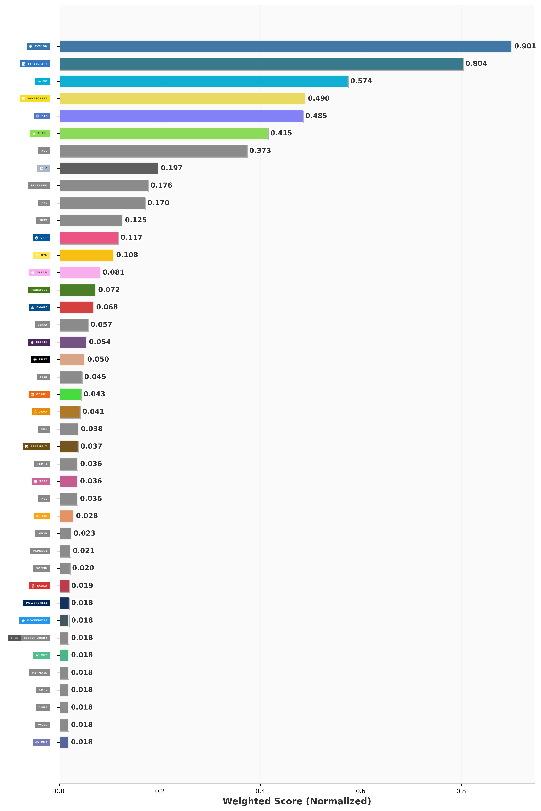

# Taylor Johnson / `becker63`

> Infrastructure, security, and AI-infra engineer focused on making complex systems legible, reproducible, and safer to operate.

I build tools that move uncertainty out of people's heads and into inspectable artifacts: static graphs, typed configs, reproducible environments, fuzzing harnesses, telemetry traces, run bundles, and release-style reports.

- Portfolio: [becker63.digital](https://www.becker63.digital)
- Writing: [essays and project notes](https://www.becker63.digital)
- GitHub: [@becker63](https://github.com/becker63)
- Last refreshed: 2026-06-10

## What I Build

- Platform, infrastructure, and security systems that are easier to reason about under pressure.
- AI evaluation tooling that treats agent changes like release candidates instead of vibes.
- Developer interfaces that compress operational ambiguity into explicit, inspectable entrypoints.
- Technical writing that makes low-level behavior and system tradeoffs legible without flattening them.

## Flagship Work

### [searchbench-go](https://github.com/becker63/searchbench-go)

Go/Pkl experiment surface for evaluating agentic code-search systems with bundled artifacts, typed domain models, and promotion-style reports.

- Why it matters: It turns agent evaluation into a release-engineering problem: baseline, candidate, regressions, artifacts, and promotion decisions.
- Stack: Go
- Last push: 2026-06-01
- GitHub: `becker63/searchbench-go`

### [searchbench](https://github.com/becker63/searchbench)

Deterministic Python harness for comparing baseline and candidate retrieval policies with scoring, telemetry, and reproducible run results.

- Why it matters: It shows how AI evaluation becomes more useful when scoring, cost, and failure state are explicit instead of anecdotal.
- Stack: Go
- Last push: 2026-06-05
- GitHub: `becker63/searchbench`

### [designing-for-two](https://github.com/becker63/designing-for-two)

Typed control-plane experiments around KCL, Crossplane, Buck2, and Nix to make infrastructure coordination more legible.

- Why it matters: It captures a core belief of mine: less expressive power can be a win when it buys local reasoning and coordination clarity.
- Stack: Python
- Last push: 2026-02-15
- GitHub: `becker63/designing-for-two`

### [nftables-structure-fuzzer](https://github.com/becker63/nftables-structure-fuzzer)

Structure-aware Nim/Nix fuzzing harness for Linux firewall semantics, libnftnl object construction, and Netlink serialization boundaries.

- Why it matters: It traces security authority across the userland-to-kernel seam rather than pretending the important behavior starts only at packet time.
- Stack: Nim
- Last push: 2026-02-15
- GitHub: `becker63/nftables-structure-fuzzer`

### [blog](https://github.com/becker63/blog)

Custom Next.js + MDX writing system for technical essays, diagrams, search, and static rendering.

- Why it matters: It is both a publishing surface and a technical artifact for communicating systems work with diagrams, search, and controlled rendering.
- Stack: TypeScript
- Last push: 2026-05-25
- GitHub: `becker63/blog`

### [nixos-from-scratch](https://github.com/becker63/nixos-from-scratch)

Flake-based NixOS and packaging experiments, including an Asahi Linux workstation on Apple Silicon.

- Why it matters: It is ongoing proof that I like owning the full stack of my tooling, from packages and wrappers down to hardware-specific configuration.
- Stack: Nix
- Last push: 2026-06-09
- GitHub: `becker63/nixos-from-scratch`

## Recent Writing

Writing snapshot: 0 published posts. Current themes: technical writing, systems design, reproducible tooling.

## GitHub Snapshot

| Public repos | Followers | Following | Stars given | Pinned repos |
| --- | --- | --- | --- | --- |
| 108 | 21 | 7 | 648 | 6 |

## Current Surface Area

- [becker63/tcp-reassembly-experiments](https://github.com/becker63/tcp-reassembly-experiments) — Low-level networking experiments around TCP stream reconstruction and packet boundary behavior.  
  C · 0 stars · updated 2024-07-06
- [becker63/designing-for-two](https://github.com/becker63/designing-for-two) — Typed control-plane experiments around KCL, Crossplane, Buck2, and Nix to make infrastructure coordination more legible.  
  Python · 1 stars · updated 2026-02-15
- [becker63/blog](https://github.com/becker63/blog) — Custom Next.js + MDX writing system for technical essays, diagrams, search, and static rendering.  
  TypeScript · 0 stars · updated 2026-05-25
- [becker63/home_lab](https://github.com/becker63/home_lab) — Home infrastructure experiments around reproducible systems, services, and local platform ownership.  
  Nix · 0 stars · updated 2026-02-15
- [becker63/home_network](https://github.com/becker63/home_network) — Typed network and infrastructure modeling work with an emphasis on legibility.  
  KCL · 0 stars · updated 2026-02-15
- [becker63/nftables-structure-fuzzer](https://github.com/becker63/nftables-structure-fuzzer) — Structure-aware Nim/Nix fuzzing harness for Linux firewall semantics, libnftnl object construction, and Netlink serialization boundaries.  
  Nim · 0 stars · updated 2026-02-15

## Recently Active Repos

- [becker63/nixos-from-scratch](https://github.com/becker63/nixos-from-scratch) — Flake-based NixOS and packaging experiments, including an Asahi Linux workstation on Apple Silicon.  
  Nix · updated 2026-06-09
- [becker63/attune](https://github.com/becker63/attune) — No public description yet.  
  TypeScript · updated 2026-06-09
- [becker63/searchbench-go](https://github.com/becker63/searchbench-go) — Go/Pkl experiment surface for evaluating agentic code-search systems with bundled artifacts, typed domain models, and promotion-style reports.  
  Go · updated 2026-06-01
- [becker63/iterative-context](https://github.com/becker63/iterative-context) — Agent and retrieval experiments centered on structured context gathering and evaluation.  
  Python · updated 2026-05-27
- [becker63/blog](https://github.com/becker63/blog) — Custom Next.js + MDX writing system for technical essays, diagrams, search, and static rendering.  
  TypeScript · updated 2026-05-25
- [becker63/jaad](https://github.com/becker63/jaad) — Just Another AI DAW  
  TypeScript · updated 2026-05-13

## Language Analytics

The chart above is generated automatically from my GitHub repositories on a schedule. It is useful as a rough signal for where time is going, not as a proxy for importance.
